# wupdedup-rs System Diagrams

## 1. High-Level System Architecture

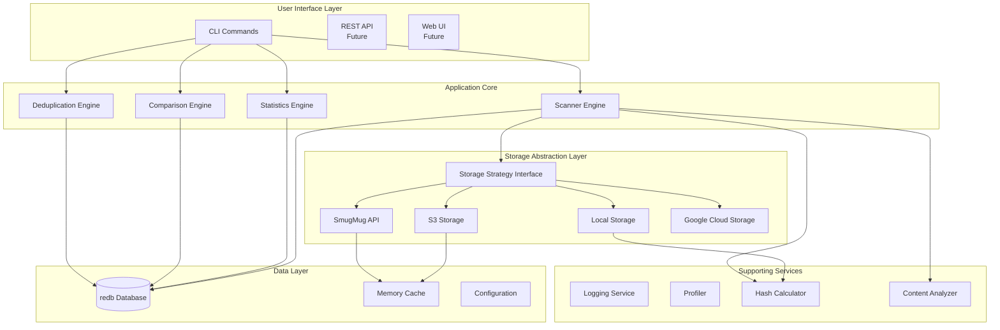

## 2. Storage Strategy Pattern

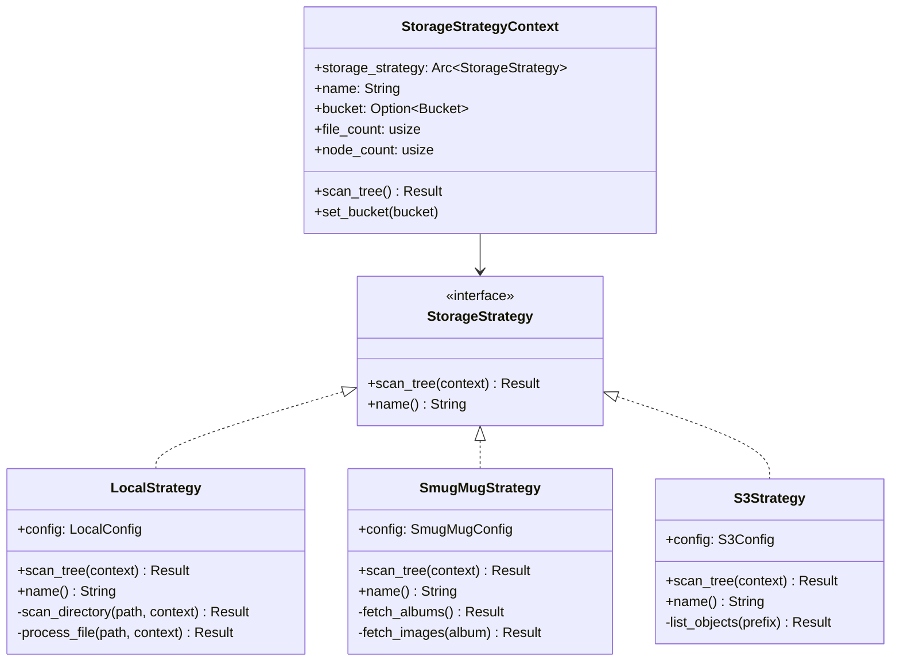

## 3. File Scanning Workflow

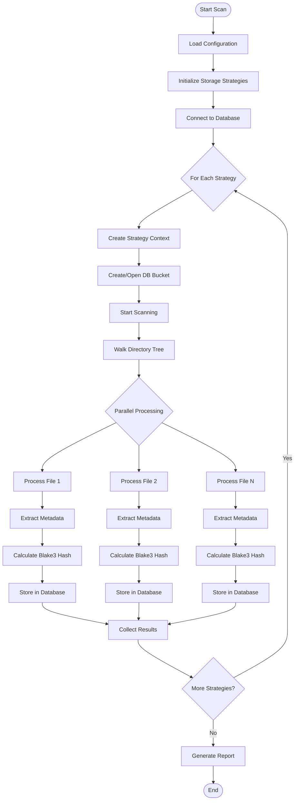

## 4. Deduplication Process

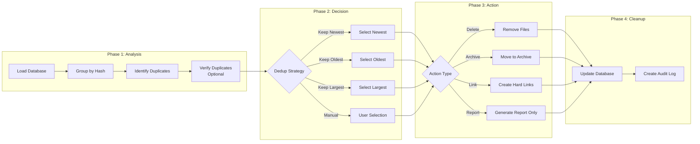

## 5. Database Schema

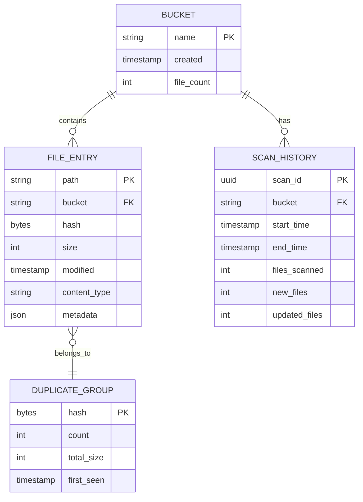

## 6. Component Interaction Sequence

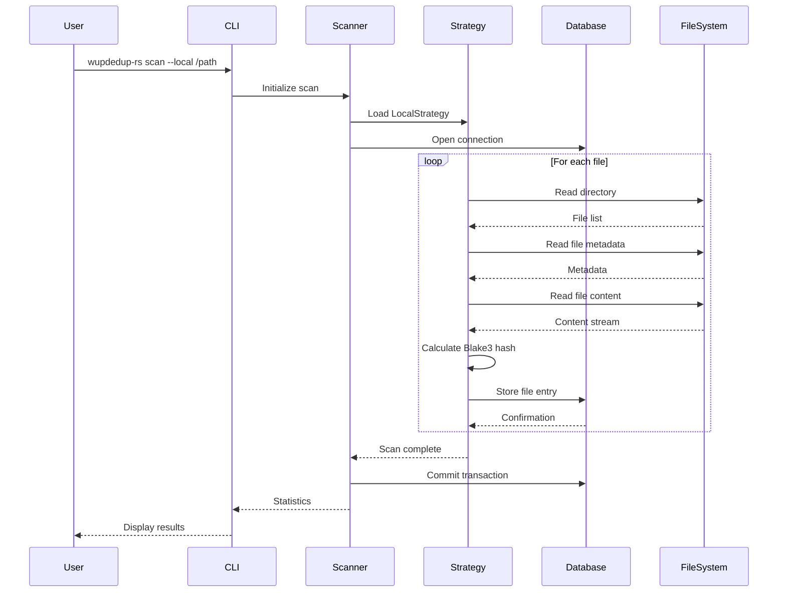

## 7. Data Flow Architecture

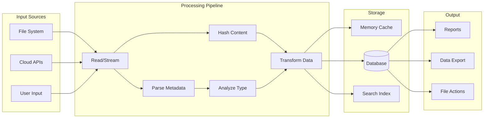

## 8. Parallel Processing Architecture

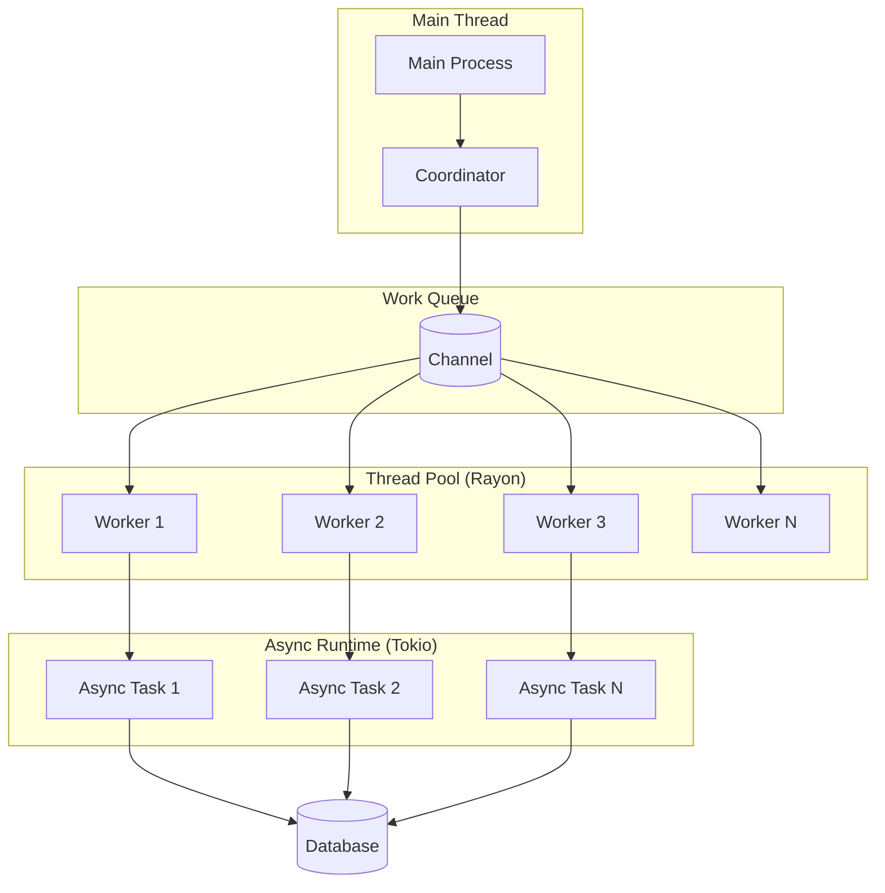

## 9. Configuration Hierarchy

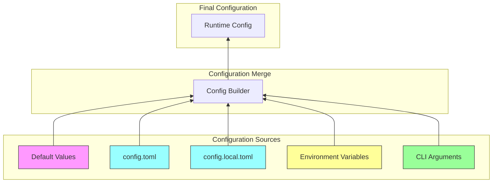

## 10. Error Handling Flow

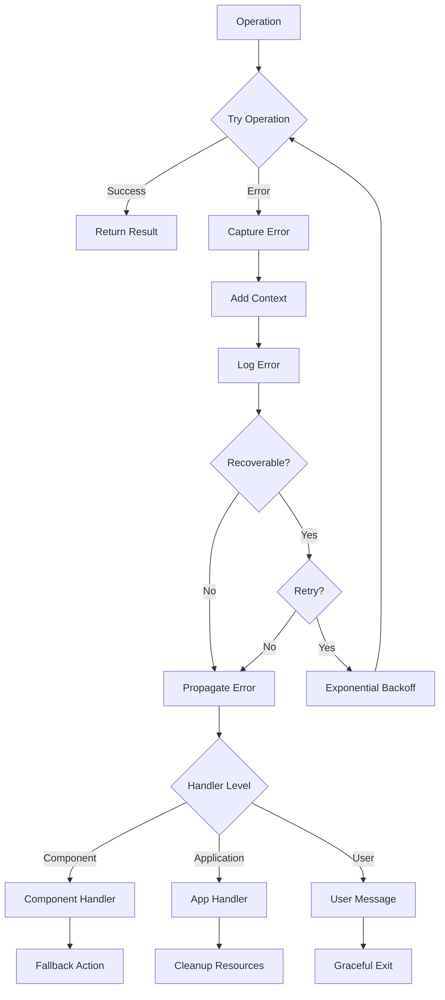

## 11. Performance Monitoring

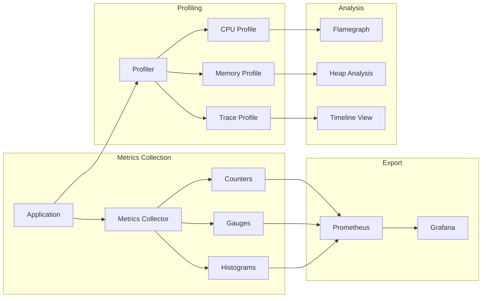

## 12. Future Architecture: Distributed System

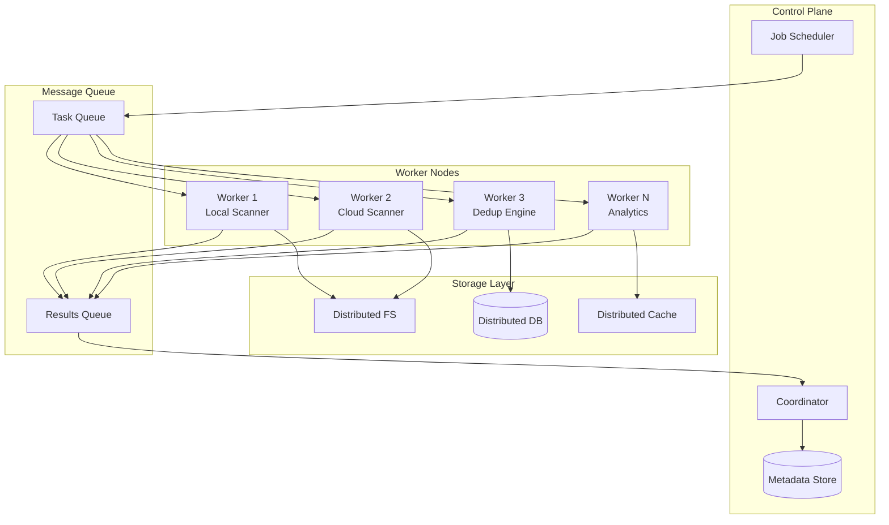

## Diagram Usage Guide

These diagrams illustrate:

1. **System Architecture**: Overall component structure and relationships
2. **Storage Strategy Pattern**: Object-oriented design for extensibility
3. **File Scanning Workflow**: Step-by-step scanning process
4. **Deduplication Process**: How duplicates are identified and handled
5. **Database Schema**: Data model and relationships
6. **Component Interaction**: Sequence of operations during scanning
7. **Data Flow**: How data moves through the system
8. **Parallel Processing**: Concurrent execution model
9. **Configuration Hierarchy**: How settings are loaded and merged
10. **Error Handling**: Error propagation and recovery
11. **Performance Monitoring**: Metrics and profiling architecture
12. **Future Architecture**: Distributed system design

Each diagram can be rendered using Mermaid-compatible tools or viewers for better visualization.